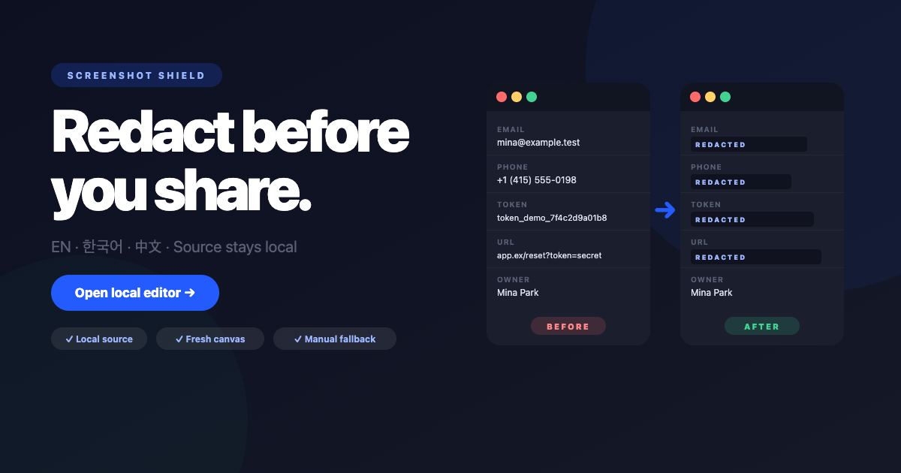
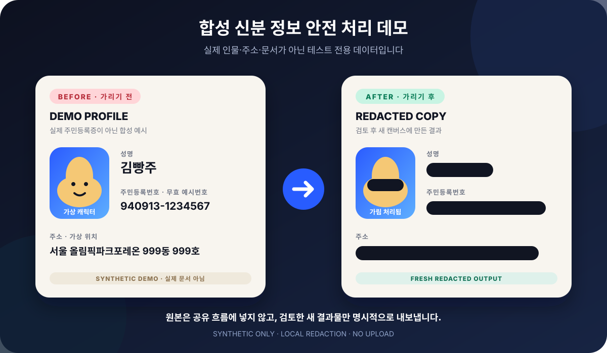

<p align="center">
  
</p>

<h1 align="center">Screenshot Shield</h1>

<p align="center">
  <strong>공유하기 전에, 먼저 가리세요.</strong><br />
  스크린샷을 서버에 올리지 않고 브라우저 안에서 직접 검토하고 가리는<br />
  한국어 우선 · 다국어 · 로컬 전용 프라이버시 편집기
</p>

<p align="center">
  <a href="https://github.com/YoungsPlace/screenshot-shield/actions/workflows/ci.yml">
    
  </a>
  <a href="https://github.com/YoungsPlace/screenshot-shield/actions/workflows/deploy.yml">
    
  </a>
  <br />
  <strong>LOCAL-ONLY SOURCE · KO / EN / ZH-CN</strong>
</p>

<p align="center">
  <a href="https://youngsplace.github.io/screenshot-shield/?view=editor&lang=ko"><strong>로컬 편집기 열기</strong></a>
  ·
  <a href="https://youngsplace.github.io/screenshot-shield/"><strong>출시 스토리 보기</strong></a>
  ·
  <a href="https://youngsplace.github.io/screenshot-shield/privacy.html?lang=ko">프라이버시</a>
  ·
  <a href="https://youngsplace.github.io/screenshot-shield/support.html?lang=ko">지원</a>
</p>

<p align="center">
  <a href="https://youngsplace.github.io/screenshot-shield/">
    
  </a>
</p>

## 왜 Screenshot Shield인가요?

- **이미지는 로컬에서만 처리됩니다.** 업로드 엔드포인트, 계정, 광고, 분석, 추적 또는 원격 OCR이 없습니다.
- **원본 대신 새 결과물을 만듭니다.** 검토가 끝난 화면을 새 캔버스에 렌더링해 PNG 또는 JPEG로 준비합니다.
- **자동 제안에 의존하지 않습니다.** OCR을 사용할 수 없거나 놓친 항목이 있어도 수동 가리기·이동·크기 조절·삭제를 계속 사용할 수 있습니다.
- **공유는 별도의 명시적 동작입니다.** 준비된 새 결과물만 사용자가 선택한 다운로드/저장 또는 공유 흐름으로 전달됩니다.

## 합성 주민등록증 데모

아래 카드는 **실제 주민등록증의 복제물이 아니라**, 민감정보 가리기 흐름을 설명하기 위해 만든 명백한 합성 프로필입니다. 캐릭터 이름 `김빵주`, 의도적으로 무효인 예시번호 `940913-1234567`, 가상 세대 `서울 올림픽파크포레온 999동 999호`는 모두 테스트 전용이며 실제 인물을 나타내지 않습니다.

<p align="center">
  
</p>

이 예시는 이름·식별번호·주소·캐릭터 얼굴을 직접 검토하여 가린 뒤, 원본이 아닌 **새로 렌더링된 결과물**만 준비하는 제품 경계를 보여줍니다. 실제 민감정보가 포함된 이미지를 저장소·이슈·테스트 fixture에 올리지 마세요.

## 바로 사용하기

| 언어         | 출시 화면                                                                | 편집기 바로 열기                                                                       |
| ------------ | ------------------------------------------------------------------------ | -------------------------------------------------------------------------------------- |
| **한국어**   | [출시 스토리](https://youngsplace.github.io/screenshot-shield/?lang=ko)  | [한국어 편집기](https://youngsplace.github.io/screenshot-shield/?view=editor&lang=ko)  |
| **English**  | [Launch story](https://youngsplace.github.io/screenshot-shield/?lang=en) | [English editor](https://youngsplace.github.io/screenshot-shield/?view=editor&lang=en) |
| **简体中文** | [发布介绍](https://youngsplace.github.io/screenshot-shield/?lang=zh-CN)  | [中文编辑器](https://youngsplace.github.io/screenshot-shield/?view=editor&lang=zh-CN)  |

Screenshot Shield prepares a newly redacted screenshot in your browser. It is a Korean-first, multilingual mobile web tool hosted on GitHub Pages—not an upload service.

[Privacy policy](https://youngsplace.github.io/screenshot-shield/privacy.html?lang=en) ·
[Support](https://youngsplace.github.io/screenshot-shield/support.html?lang=en) ·
[Security reporting policy](./SECURITY.md)

## Phone workflow

1. Open the language link above and choose a screenshot from **Photos** or **Files**. On desktop, paste and drag/drop may also be available.
2. Review any local suggestions, then add, select, move, resize, or delete manual redaction regions. Manual redaction remains the fallback when OCR is unavailable or misses something.
3. Inspect the preview and prepare a fresh PNG or JPEG. The editor draws a new canvas output instead of reusing the source bytes or its metadata.
4. Use a separate, user-initiated Share action where the browser supports file sharing, or download/save the same prepared redacted file.

The selected share destination—not Screenshot Shield—may store or upload the redacted output under its own policy. Review the finished image before any handoff.

## Editor-first, language, and installation behavior

The root service is a Korean marketing entry. To bypass it, use an editor-first URL such as:

- `https://youngsplace.github.io/screenshot-shield/?view=editor&lang=ko`
- `https://youngsplace.github.io/screenshot-shield/?view=editor&lang=en`
- `https://youngsplace.github.io/screenshot-shield/?view=editor&lang=zh-CN`

The public language tags are exactly `ko`, `en`, and `zh-CN`. Korean is deterministic for a bare, missing, invalid, malformed, or duplicate `lang` value; browser language is never consulted. `lang=zh` is normalized to `zh-CN` by the app.

A normal explicit language selection can persist only that public tag in `localStorage` as `screenshot-shield.locale`. The installed/home-screen start opens editor-first and reads this one preference before rendering; it reopens in the last language explicitly selected in normal or installed chrome. If that storage is cleared, unavailable, invalid, or blocked, the installed start falls back to Korean. A normal bare URL does **not** read the preference and remains Korean. No image, filename, redaction, OCR result, prepared output, or editing history is persisted.

The app ships one immutable web manifest and one mobile-web identity. Browser installation is browser-controlled: on iPhone or iPad Safari, use **Share → Add to Home Screen**; on Android Chromium, use **Install app** or **Add to Home screen** only when the browser offers it. Menu names and availability vary by browser, operating system, and policy. An installed home-screen experience is still a mobile web app, not a promise of a native binary or an app-store listing.

## Availability and boundaries

The availability claimed here is the GitHub Pages web service above. This repository now includes branded Capacitor iOS/Android Phase-0 projects and fail-closed policy checks, but native runtime/share fan-out is deliberately blocked by `npm run native:preflight` until the exact toolchain and real-device launch/rename/timestamp/kill-matrix evidence exists. Any native availability claim remains further blocked by signing, cohort, review, and store-availability evidence. No App Store or Google Play release is claimed.

There is no web service worker and no web offline-support claim. A browser may keep its own resources according to its policies, but Screenshot Shield does not provide an offline editor or offline cache lifecycle.

The current web app has no application upload endpoint, backend, account system, advertising, analytics, telemetry, tracking, remote OCR, or third-party image-processing API. Source images remain in browser memory while editing. The only intended image egress is a freshly prepared redacted output through your explicit download/save or Share action.

OCR and automatic detection are review aids, not guarantees. OCR can be unavailable, and it can miss sensitive content. Face detection is outside the current scope. Browser extensions, compromised devices/browsers, and an altered deployment can defeat the local-processing boundary.

For the planned native design, any explicit share may use at most one newly redacted output in a bounded private cache. It excludes originals, backups, and the gallery; it is not a general image library. That planned boundary does not guarantee receiver success, destination retention, or deletion, and it is not evidence that a native app is available today. See [PRIVACY.md](./PRIVACY.md) for the complete distinction.

## Report an issue safely

For general, non-sensitive help, use the [public repository](https://github.com/YoungsPlace/screenshot-shield) and, when GitHub is reachable, [Issues](https://github.com/YoungsPlace/screenshot-shield/issues). Include the app/deployment version, full URL and language, device, OS/browser versions, reproduction steps, expected and actual result, and only redacted or synthetic evidence.

Do not put source screenshots, credentials, real secrets, personal data, or exploit payloads in a public issue. Use the [security reporting policy](./SECURITY.md) for unexpected network activity, image persistence, output/share-boundary concerns, or other vulnerabilities. Repository maintenance does not promise synchronous support or a particular response time.

## Future extension boundary

Document scanning, perspective correction, contrast enhancement, PDF, and additional image formats are not part of the current release. Future work should extend the local pipeline in separate stages—acquisition, non-destructive transforms, redaction, review, and format encoding—while keeping the original input isolated from share/download APIs. New encoders must consume the reviewed rendered result rather than the source file.

Advertising or other monetization would require a separate approved privacy, consent, network, and content-isolation design. It must not gain access to source images, OCR text, redaction geometry, prepared files, or editing behavior, and it must not weaken the usable no-tracking local editor.

## Contributing and local development

Read [CONTRIBUTING.md](./CONTRIBUTING.md) before proposing a change. Keep the browser-local processing boundary, existing live routes, `?embed=editor`, the launch experience, and the GitHub Pages subpath intact.

```bash
npm ci
npm run typecheck
npm run lint
npm run format:check
npm test
npm run native:policy
npm run store:verify
VITE_BASE_PATH=/screenshot-shield/ npm run build
VITE_BASE_PATH=/screenshot-shield/ PLAYWRIGHT_BASE_URL=http://127.0.0.1:4173/screenshot-shield/ npm run e2e
```

`npm run build:native` and `npm run cap:sync` both run the blocking native preflight first. They are expected to stop on a machine without the reviewed full Xcode/JDK/Android SDK, connected physical iOS and Android devices, immutable toolchain/SPM locks, and signed physical-gate attestation. Do not bypass that stop. Credential-free release preparation lives in [`docs/native-release-runbook.md`](./docs/native-release-runbook.md), [`docs/rollback-and-observation.md`](./docs/rollback-and-observation.md), and [`store/`](./store/).

The project is a Vite/React static application. Tests use synthetic images and should verify behavior rather than relying on any external OCR service. Do not add a backend, upload relay, telemetry, remote OCR, service worker, web offline claim, Web Share Target, or image persistence without a separately approved privacy and lifecycle design.

## GitHub Pages deployment

GitHub Pages deploys the static `dist/` artifact through [`.github/workflows/deploy.yml`](./.github/workflows/deploy.yml). In repository settings, choose **Pages → Build and deployment → GitHub Actions**, then merge approved changes to `main`. The production build must preserve Vite's `/screenshot-shield/` base path; local development remains rooted at `/`.

Deployment is not a native release. Do not state that a store build is available unless the independently accepted signing, device, store-review, and public-availability evidence exists.

## License

MIT. See [LICENSE](./LICENSE).
