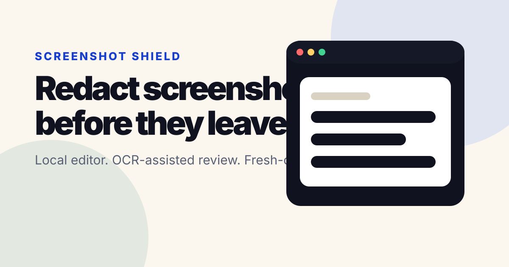

<div align="center">

# Screenshot Shield

**Clean screenshots before they leave your browser.**

[](https://github.com/YoungsPlace/screenshot-shield/actions/workflows/ci.yml)
[](https://github.com/YoungsPlace/screenshot-shield/actions/workflows/deploy.yml)

[**Open the live editor**](https://youngsplace.github.io/screenshot-shield/) · [**Read and try the launch story**](https://youngsplace.github.io/screenshot-shield/launch.html) · English · 한국어 · 中文



</div>

Screenshot Shield is a privacy-first, local-only web app for removing sensitive information from screenshots. Paste or drop an image, review detection suggestions, draw final redaction regions, and export a newly rendered PNG or JPEG without uploading the source image.

> **한국어** — 스크린샷을 서버에 올리지 않고 브라우저 안에서 민감한 정보를 가리고 새 파일로 내보냅니다.
>
> **简体中文** — 无需上传截图，即可在浏览器本地遮盖敏感信息并导出全新文件。

## Launch highlights

- Visual before/after product demo designed for SNS and Threads sharing.
- Complete English, Korean, and Simplified Chinese marketing experience.
- No upload endpoint, analytics, external fonts, or third-party runtime requests.
- Responsive desktop and mobile layouts with keyboard and reduced-motion support.
- The editor stays out of the way until the primary CTA opens it.

## Product goals

- Import PNG, JPEG, and WebP screenshots by paste, drag/drop, or file picker.
- Keep source images in browser memory only; no upload endpoint, analytics, remote fonts, or third-party runtime APIs.
- Suggest likely sensitive text for review: email addresses, phone numbers, payment-card-like numbers, IPv4 addresses, URLs with query strings, and long token-like IDs.
- Keep manual redaction fully usable even when OCR assets fail to initialize.
- Export a newly encoded PNG or JPEG from a fresh canvas so metadata and original bytes are stripped.

## Local development

```bash
npm install
npm run typecheck
npm run lint
npm run format:check
npm test
npm run build
npm run e2e
```

The app is a Vite/React static application. Playwright tests start the production preview server from `npm run preview` after `npm run build`.

## Deployment

GitHub Pages deployment is handled by `.github/workflows/deploy.yml`.

1. In GitHub repository settings, set **Pages → Build and deployment → Source** to **GitHub Actions**.
2. Push to `main`.
3. The Pages workflow installs dependencies, runs the full verification gate, builds the static site, and uploads `dist/`.

Vite must be configured with a repository-subpath-safe base path for production Pages builds, typically `/screenshot-shield/`, while local development remains `/`.

## Verification scope

The current release gate runs 69 unit/component checks and 17 Playwright scenarios across desktop and mobile Chromium. It verifies:

- English, Korean, and Simplified Chinese switching, localized CTAs, and document language.
- Import → manual redaction → fresh-canvas PNG/JPEG export with synthetic screenshots.
- Detector coverage, typed import failures, keyboard focus, and reduced-motion behavior.
- 390px and 1440px layouts without horizontal overflow.
- Zero third-party runtime network requests after application load.

## Privacy model

Screenshot Shield is built for local processing. The browser decodes the selected image, stores editor state in memory, and exports by drawing into a clean canvas. See [PRIVACY.md](./PRIVACY.md) and [SECURITY.md](./SECURITY.md) for the exact threat model and limitations.

## Limitations

- Detection suggestions are review aids, not guarantees.
- OCR quality depends on screenshot clarity and same-origin OCR asset availability.
- Face detection is out of MVP scope; users can manually redact faces or any other area.
- A malicious browser extension, compromised dependency, or modified deployment can break the local-only model.

## License

MIT. See [LICENSE](./LICENSE).
